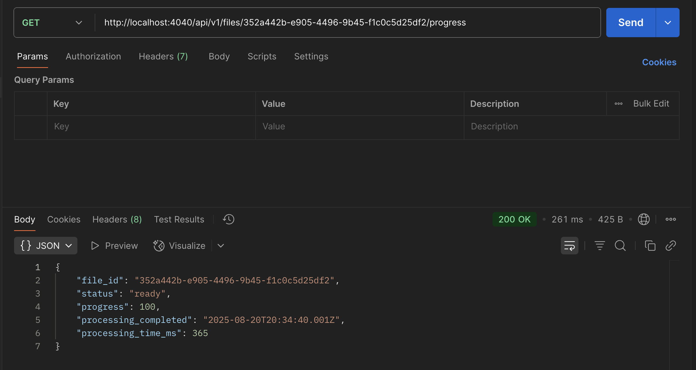

# FileTracker API

A robust Node.js REST API for file upload, processing, and management with real-time progress tracking. FileTracker supports CSV and Excel file formats, providing comprehensive file parsing, status monitoring, and data retrieval capabilities.

##  Features

- **File Upload & Processing**: Upload CSV and Excel files with automatic parsing
- **Real-time Progress Tracking**: Monitor file processing status with detailed progress updates
- **RESTful API**: Clean, well-structured REST endpoints
- **MongoDB Integration**: Persistent storage with MongoDB
- **File Management**: List, retrieve, and delete uploaded files
- **Error Handling**: Comprehensive error handling and validation
- **CORS Support**: Cross-origin resource sharing enabled
- **Request Logging**: Built-in request logging middleware

##  Tech Stack

- **Backend**: Node.js, Express.js
- **Database**: MongoDB with Mongoose ODM
- **File Processing**: csv-parser, xlsx
- **File Upload**: Multer middleware
- **Progress Tracking**: In-memory progress store with cleanup
- **Development**: Nodemon for hot reloading

##  Prerequisites

- Node.js (v14 or higher)
- MongoDB database
- npm or yarn package manager

##  Setup Instructions

### 1. Clone the Repository

```bash
git clone <repository-url>
cd FileTracker
```

### 2. Install Dependencies

```bash
npm install
```

### 3. Environment Configuration

Create a `.env` file in the root directory:

```env
PORT=4040
NODE_ENV=development
DEV_MONGODB_URI=mongodb://localhost:27017/filetracker
```

### 4. Start the Server

**Development mode:**
```bash
npm run dev
```

**Production mode:**
```bash
node server.js
```

The server will start on `http://localhost:4040`

##  API Documentation

### Base URL
```
http://localhost:4040/api/v1
```

### Authentication
Currently, the API doesn't require authentication. All endpoints are publicly accessible.

### Endpoints

#### 1. Upload File
**POST** `/files`

Upload a CSV or Excel file for processing.

**Request:**
- Content-Type: `multipart/form-data`
- Body: Form data with `file` field containing the file

**Supported File Types:**
- CSV files (`.csv`)
- Excel files (`.xlsx`, `.xls`)

**File Size Limit:** 500MB

**Response:**
```json
{
    "success": true,
    "file_id": "57ecee8b-58a5-4966-9a6f-807e63b2bd5a",
    "filename": "2025-03-06.csv",
    "check_status": "http://localhost:4040/api/v1/files/57ecee8b-58a5-4966-9a6f-807e63b2bd5a/progress"
}
```

#### 2. Check File Progress
**GET** `/files/{file_id}/progress`

Get the current processing status and progress of a file.

**Response:**
```json
{
    "file_id": "57ecee8b-58a5-4966-9a6f-807e63b2bd5a",
    "status": "ready",
    "progress": 100,
    "processing_completed": "2025-08-20T21:16:51.251Z",
    "processing_time_ms": 66
}
```

**Status Values:**
- `uploading`: File is being uploaded
- `processing`: File is being parsed and processed
- `ready`: File processing is complete
- `failed`: File processing failed

#### 3. Get File Content
**GET** `/files/{file_id}`

Retrieve the parsed content and metadata of a processed file.

**Response:**
```json
{
    "success": true,
    "file_id": "57ecee8b-58a5-4966-9a6f-807e63b2bd5a",
    "filename": "2025-03-06.csv",
    "status": "ready",
    "created_at": "2025-08-20T21:16:50.555Z",
    "content": [
        {
            "SerialNumber": "1",
            "Gender": "female",
            "Title": "Miss",
            "First Name": "Yolanda",
            "Last Name": "Fuentes",
            "Street Number": "78",
            "Street Name": "Calle de Atocha",
            "City": "Vigo",
            "State": "Canarias",
            "Country": "Spain",
            "Postcode": "35973",
            "Latitude": "-31.6787",
            "Longitude": "45.7068",
            "Timezone Offset": "-7:00",
            "Timezone Description": "Mountain Time (US & Canada)",
            "Email": "yolanda.fuentes@example.com",
            "UUID": "f45206f3-4cc3-4c92-a6a9-b4f15c23c106",
            "Username": "organicpeacock354",
            "Password": "orchard",
            "Salt": "UXpWJjky",
            "MD5": "c7c3588d906fe5d95939acadbd74d184",
            "SHA1": "44acdf4fc999b1b13a70fe48c4f973e0e249552c",
            "SHA256": "612c2302ad1e6f20ea8e467946d9780a9053a0094dab108b44369b1189903105",
            "DOB": "2000-04-14T08:42:40.097Z",
            "Age": "24",
            "Registered Date": "2004-02-05T09:11:34.898Z",
            "Registered Age": "21",
            "Phone": "971-271-036",
            "Cell": "654-603-119",
            "ID Name": "DNI",
            "ID Value": "97934764-P",
            "Picture (Large)": "https://randomuser.me/api/portraits/women/33.jpg",
            "Picture (Medium)": "https://randomuser.me/api/portraits/med/women/33.jpg",
            "Picture (Thumbnail)": "https://randomuser.me/api/portraits/thumb/women/33.jpg",
            "Nationality": "ES"
        }
    ],
    "total_records": 3,
    "processing_completed": "2025-08-20T21:16:51.251Z",
    "processing_time_ms": 66
}
```

#### 4. List All Files
**GET** `/files`

Retrieve a list of all uploaded files with pagination and filtering options.

**Query Parameters:**
- `status` (optional): Filter by status (`uploading`, `processing`, `ready`, `failed`)
- `page` (optional): Page number (default: 1)
- `limit` (optional): Items per page (default: 50, max: 100)
- `sort` (optional): Sort field (default: `created_at`)
- `order` (optional): Sort order (`asc` or `desc`, default: `desc`)

**Response:**
```json
{
    "success": true,
    "message": "Files retrieved successfully",
    "data": {
        "files": [
            {
                "file_id": "57ecee8b-58a5-4966-9a6f-807e63b2bd5a",
                "filename": "2025-03-06.csv",
                "status": "ready",
                "created_at": "2025-08-20T21:16:50.555Z",
                "total_records": 3,
                "progress": 100,
                "processing_time_ms": 66,
                "processing_time_formatted": "66ms",
                "actions": {
                    "get_content": "http://localhost:4040/api/v1/files/57ecee8b-58a5-4966-9a6f-807e63b2bd5a",
                    "check_progress": "http://localhost:4040/api/v1/files/57ecee8b-58a5-4966-9a6f-807e63b2bd5a/progress",
                    "delete": "http://localhost:4040/api/v1/files/57ecee8b-58a5-4966-9a6f-807e63b2bd5a"
                }
            }
        ],
        "pagination": {
            "current_page": 1,
            "total_pages": 1,
            "total_files": 4,
            "files_per_page": 50,
            "has_next_page": false,
            "has_prev_page": false,
            "next_page": null,
            "prev_page": null
        },
        "summary": {
            "total_files": 4,
            "status_distribution": {
                "ready": 4
            },
            "total_size_bytes": 0,
            "total_size_formatted": "0 B",
            "total_records": 12
        },
        "filters": {
            "status": "all",
            "sort_by": "created_at",
            "sort_order": "desc"
        }
    }
}
```

#### 5. Delete File
**DELETE** `/files/{file_id}`

Delete a file and its associated data from the system.

**Response:**
```json
{
    "success": true,
    "message": "File deleted successfully",
    "deleted_file": {
        "file_id": "57ecee8b-58a5-4966-9a6f-807e63b2bd5a",
        "filename": "2025-03-06.csv",
        "status": "ready",
        "created_at": "2025-08-20T21:16:50.555Z",
        "records_deleted": 3,
        "processing_time_ms": 66
    },
    "cleanup_summary": {
        "database_record_deleted": true,
        "progress_data_deleted": true,
        "temporary_files_deleted": 0
    }
}
```

##  Sample Requests/Responses

### Upload File Example

**cURL:**
```bash
curl -X POST http://localhost:4040/api/v1/files \
  -H "Content-Type: multipart/form-data" \
  -F "file=@/path/to/your/file.csv"
```

**Response:**
```json
{
    "success": true,
    "file_id": "57ecee8b-58a5-4966-9a6f-807e63b2bd5a",
    "filename": "2025-03-06.csv",
    "check_status": "http://localhost:4040/api/v1/files/57ecee8b-58a5-4966-9a6f-807e63b2bd5a/progress"
}
```

### Check Progress Example

**cURL:**
```bash
curl -X GET http://localhost:4040/api/v1/files/57ecee8b-58a5-4966-9a6f-807e63b2bd5a/progress
```

**Response:**
```json
{
    "file_id": "57ecee8b-58a5-4966-9a6f-807e63b2bd5a",
    "status": "ready",
    "progress": 100,
    "processing_completed": "2025-08-20T21:16:51.251Z",
    "processing_time_ms": 66
}
```

### Get File Content Example

**cURL:**
```bash
curl -X GET http://localhost:4040/api/v1/files/57ecee8b-58a5-4966-9a6f-807e63b2bd5a
```

**Response:**
```json
{
    "success": true,
    "file_id": "57ecee8b-58a5-4966-9a6f-807e63b2bd5a",
    "filename": "2025-03-06.csv",
    "status": "ready",
    "created_at": "2025-08-20T21:16:50.555Z",
    "content": [
        {
            "SerialNumber": "1",
            "Gender": "female",
            "Title": "Miss",
            "First Name": "Yolanda",
            "Last Name": "Fuentes",
            "Street Number": "78",
            "Street Name": "Calle de Atocha",
            "City": "Vigo",
            "State": "Canarias",
            "Country": "Spain",
            "Postcode": "35973",
            "Latitude": "-31.6787",
            "Longitude": "45.7068",
            "Timezone Offset": "-7:00",
            "Timezone Description": "Mountain Time (US & Canada)",
            "Email": "yolanda.fuentes@example.com",
            "UUID": "f45206f3-4cc3-4c92-a6a9-b4f15c23c106",
            "Username": "organicpeacock354",
            "Password": "orchard",
            "Salt": "UXpWJjky",
            "MD5": "c7c3588d906fe5d95939acadbd74d184",
            "SHA1": "44acdf4fc999b1b13a70fe48c4f973e0e249552c",
            "SHA256": "612c2302ad1e6f20ea8e467946d9780a9053a0094dab108b44369b1189903105",
            "DOB": "2000-04-14T08:42:40.097Z",
            "Age": "24",
            "Registered Date": "2004-02-05T09:11:34.898Z",
            "Registered Age": "21",
            "Phone": "971-271-036",
            "Cell": "654-603-119",
            "ID Name": "DNI",
            "ID Value": "97934764-P",
            "Picture (Large)": "https://randomuser.me/api/portraits/women/33.jpg",
            "Picture (Medium)": "https://randomuser.me/api/portraits/med/women/33.jpg",
            "Picture (Thumbnail)": "https://randomuser.me/api/portraits/thumb/women/33.jpg",
            "Nationality": "ES"
        },
        {
            "SerialNumber": "2",
            "Gender": "female",
            "Title": "Miss",
            "First Name": "Yolanda",
            "Last Name": "Fuentes",
            "Street Number": "78",
            "Street Name": "Calle de Atocha",
            "City": "Vigo",
            "State": "Canarias",
            "Country": "Spain",
            "Postcode": "35973",
            "Latitude": "-31.6787",
            "Longitude": "45.7068",
            "Timezone Offset": "-7:00",
            "Timezone Description": "Mountain Time (US & Canada)",
            "Email": "yolanda.fuentes@example.com",
            "UUID": "f45206f3-4cc3-4c92-a6a9-b4f15c23c106",
            "Username": "organicpeacock354",
            "Password": "orchard",
            "Salt": "UXpWJjky",
            "MD5": "c7c3588d906fe5d95939acadbd74d184",
            "SHA1": "44acdf4fc999b1b13a70fe48c4f973e0e249552c",
            "SHA256": "612c2302ad1e6f20ea8e467946d9780a9053a0094dab108b44369b1189903105",
            "DOB": "2000-04-14T08:42:40.097Z",
            "Age": "24",
            "Registered Date": "2004-02-05T09:11:34.898Z",
            "Registered Age": "21",
            "Phone": "971-271-036",
            "Cell": "654-603-119",
            "ID Name": "DNI",
            "ID Value": "97934764-P",
            "Picture (Large)": "https://randomuser.me/api/portraits/women/33.jpg",
            "Picture (Medium)": "https://randomuser.me/api/portraits/med/women/33.jpg",
            "Picture (Thumbnail)": "https://randomuser.me/api/portraits/thumb/women/33.jpg",
            "Nationality": "ES"
        },
        {
            "SerialNumber": "3",
            "Gender": "female",
            "Title": "Ms",
            "First Name": "Natalie",
            "Last Name": "Moore",
            "Street Number": "8099",
            "Street Name": "Timber Wolf Trail",
            "City": "Hollywood",
            "State": "North Carolina",
            "Country": "United States",
            "Postcode": "42098",
            "Latitude": "87.0504",
            "Longitude": "155.1043",
            "Timezone Offset": "-12:00",
            "Timezone Description": "Eniwetok, Kwajalein",
            "Email": "natalie.moore@example.com",
            "UUID": "b9f0cd6a-5c08-4948-98cc-0c49c0e54035",
            "Username": "silverbear789",
            "Password": "rocket",
            "Salt": "VaGLtHZI",
            "MD5": "98a06b9cae409e856f1c20378354fefb",
            "SHA1": "cea1eb19b667d51e408753ac547cbdee491022a8",
            "SHA256": "de47c448527da13e675871ec52d87390c3d65627a4eac9ff2034be49606dc997",
            "DOB": "1959-08-23T16:51:40.258Z",
            "Age": "65",
            "Registered Date": "2014-10-25T22:19:54.510Z",
            "Registered Age": "10",
            "Phone": "(293) 401-3709",
            "Cell": "(822) 897-8033",
            "ID Name": "SSN",
            "ID Value": "624-86-1965",
            "Picture (Large)": "https://randomuser.me/api/portraits/women/74.jpg",
            "Picture (Medium)": "https://randomuser.me/api/portraits/med/women/74.jpg",
            "Picture (Thumbnail)": "https://randomuser.me/api/portraits/thumb/women/74.jpg",
            "Nationality": "US"
        }
    ],
    "total_records": 3,
    "processing_completed": "2025-08-20T21:16:51.251Z",
    "processing_time_ms": 66
}
```

### List Files Example

**cURL:**
```bash
curl -X GET "http://localhost:4040/api/v1/files?page=1&limit=10&status=ready&sort=created_at&order=desc"
```

**Response:**
```json
{
    "success": true,
    "message": "Files retrieved successfully",
    "data": {
        "files": [
            {
                "file_id": "57ecee8b-58a5-4966-9a6f-807e63b2bd5a",
                "filename": "2025-03-06.csv",
                "status": "ready",
                "created_at": "2025-08-20T21:16:50.555Z",
                "total_records": 3,
                "progress": 100,
                "actions": {
                    "get_content": "http://localhost:4040/api/v1/files/57ecee8b-58a5-4966-9a6f-807e63b2bd5a",
                    "check_progress": "http://localhost:4040/api/v1/files/57ecee8b-58a5-4966-9a6f-807e63b2bd5a/progress",
                    "delete": "http://localhost:4040/api/v1/files/57ecee8b-58a5-4966-9a6f-807e63b2bd5a"
                }
            },
            {
                "file_id": "204719d2-1fe1-407b-8d44-4a4f0f293fd9",
                "filename": "2025-03-06.csv",
                "status": "ready",
                "created_at": "2025-08-20T20:32:11.678Z",
                "total_records": 3,
                "progress": 100,
                "actions": {
                    "get_content": "http://localhost:4040/api/v1/files/204719d2-1fe1-407b-8d44-4a4f0f293fd9",
                    "check_progress": "http://localhost:4040/api/v1/files/204719d2-1fe1-407b-8d44-4a4f0f293fd9/progress",
                    "delete": "http://localhost:4040/api/v1/files/204719d2-1fe1-407b-8d44-4a4f0f293fd9"
                }
            },
            {
                "file_id": "4d0f1380-c369-4299-bc36-e0de24126e0c",
                "filename": "2025-03-06.csv",
                "status": "ready",
                "created_at": "2025-08-20T19:30:41.966Z",
                "total_records": 3,
                "progress": 100,
                "actions": {
                    "get_content": "http://localhost:4040/api/v1/files/4d0f1380-c369-4299-bc36-e0de24126e0c",
                    "check_progress": "http://localhost:4040/api/v1/files/4d0f1380-c369-4299-bc36-e0de24126e0c/progress",
                    "delete": "http://localhost:4040/api/v1/files/4d0f1380-c369-4299-bc36-e0de24126e0c"
                }
            },
            {
                "file_id": "201d5147-675d-4d59-8970-214e1ca28bd9",
                "filename": "2025-03-06.csv",
                "status": "ready",
                "created_at": "2025-08-20T19:23:28.160Z",
                "total_records": 3,
                "progress": 100,
                "actions": {
                    "get_content": "http://localhost:4040/api/v1/files/201d5147-675d-4d59-8970-214e1ca28bd9",
                    "check_progress": "http://localhost:4040/api/v1/files/201d5147-675d-4d59-8970-214e1ca28bd9/progress",
                    "delete": "http://localhost:4040/api/v1/files/201d5147-675d-4d59-8970-214e1ca28bd9"
                }
            }
        ],
        "pagination": {
            "current_page": 1,
            "total_pages": 1,
            "total_files": 4,
            "files_per_page": 50,
            "has_next_page": false,
            "has_prev_page": false,
            "next_page": null,
            "prev_page": null
        },
        "summary": {
            "total_files": 4,
            "status_distribution": {
                "ready": 4
            },
            "total_size_bytes": 0,
            "total_size_formatted": "0 B",
            "total_records": 12
        },
        "filters": {
            "status": "all",
            "sort_by": "created_at",
            "sort_order": "desc"
        }
    }
}
```

### Delete File Example

**cURL:**
```bash
curl -X DELETE http://localhost:4040/api/v1/files/57ecee8b-58a5-4966-9a6f-807e63b2bd5a
```

**Response:**
```json
{
    "success": true,
    "message": "File deleted successfully",
    "deleted_file": {
        "file_id": "57ecee8b-58a5-4966-9a6f-807e63b2bd5a",
        "filename": "2025-03-06.csv",
        "status": "ready",
        "created_at": "2025-08-20T21:16:50.555Z",
        "records_deleted": 3,
        "processing_time_ms": 66
    },
    "cleanup_summary": {
        "database_record_deleted": true,
        "progress_data_deleted": true,
        "temporary_files_deleted": 0
    }
}
```

##  Testing with Postman

You can test the API using Postman or any other API testing tool. Here are the key endpoints to test:

### Postman Collection

1. **Upload File**
   - Method: `POST`
   - URL: `http://localhost:4040/api/v1/files`
   - Body: `form-data`
   - Key: `file` (Type: File)
   - Value: Select your CSV or Excel file

2. **Check Progress**
   - Method: `GET`
   - URL: `http://localhost:4040/api/v1/files/{file_id}/progress`
   - Replace `{file_id}` with the actual file ID from upload response

3. **Get File Content**
   - Method: `GET`
   - URL: `http://localhost:4040/api/v1/files/{file_id}`
   - Replace `{file_id}` with the actual file ID

4. **List All Files**
   - Method: `GET`
   - URL: `http://localhost:4040/api/v1/files`
   - Query Params (optional):
     - `status`: `ready`, `processing`, `uploading`, `failed`
     - `page`: `1`
     - `limit`: `50`
     - `sort`: `created_at`
     - `order`: `desc`

5. **Delete File**
   - Method: `DELETE`
   - URL: `http://localhost:4040/api/v1/files/{file_id}`
   - Replace `{file_id}` with the actual file ID

### Postman Screenshots

The following screenshots show the API testing in Postman:





##  Error Handling

The API provides comprehensive error handling with appropriate HTTP status codes:

- `400 Bad Request`: Invalid request parameters or file type
- `404 Not Found`: File not found
- `422 Unprocessable Entity`: File processing failed
- `500 Internal Server Error`: Server-side errors

##  MVC Project Structure

```
FileTracker/
├── src/
│   ├── controllers/
│   │   ├── file.controller.js          # File upload controller
│   │   ├── fileContent.controller.js   # File content retrieval
│   │   ├── listFile.controller.js      # List files controller
│   │   ├── status.controller.js        # Progress tracking
│   │   └── deleteFile.controller.js    # File deletion
│   ├── database/
│   │   └── db.connect.js               # MongoDB connection
│   ├── middlewares/
│   │   ├── multer.middleware.js        # File upload middleware
│   │   └── requestlogger.middleware.js # Request logging
│   ├── models/
│   │   └── file.model.js               # File data model
│   ├── routes/
│   │   └── v1/
│   │       └── v1.router.js            # API routes
│   ├── service/
│   │   └── fileParser.service.js       # File parsing service
│   └── utils/
│       └── progressStore.js            # Progress tracking utility
├── uploads/                            # Uploaded files directory
├── server.js                           # Main server file
├── package.json                        # Dependencies and scripts
└── README.md                           # This file
```

---

## A Special Note

Thank you for giving me the opportunity to work on this project and for taking the time to review it. I truly appreciate your consideration and look forward to your response.

**The End**
